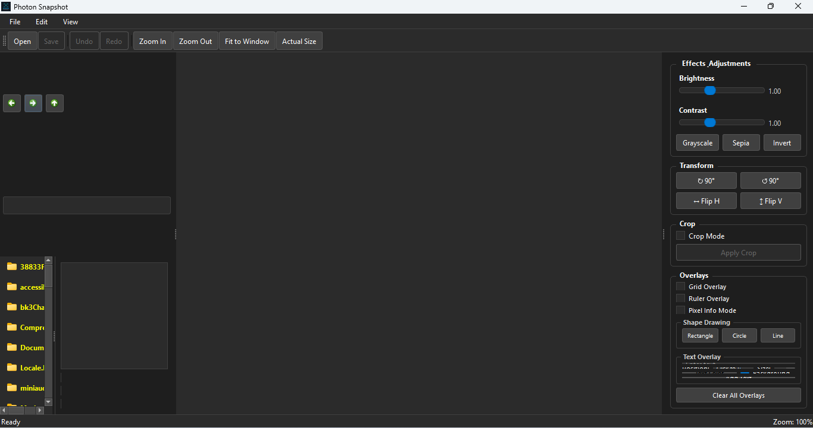

# Photon Snapshot
Image viewer/editor. Built with Python using PySide6 QT and Pillow.


## Features
* In window file explorer which allows you to browse and open images directly without having to use the open file dialog.
* Image effects (contrast, brightness, scaling, and more)
* Transform, crop, and resize.
* Apply various overlays (grid, ruler, text)

## Building
### Build Environment
Photon Snapshot requires Python 3.12 or higher. You'll also require UPX for compressing the executable's size.
Download UPX from [here](https://github.com/upx/upx/releases/tag/v5.0.1).

Clone the repo
```bash
git clone https://github.com/still-standing88/photon-snapshot.git
cd photon-snapshot
```

Create a new environment, or install packages globally
```bash
python -m venv venv
```

Then on Windows
```bash
venv\scripts\activate
```

For Linux/Mac
```bash
source venv/bin/activate
```

Then install requirements
```bash
pip install -r requirements.txt
```

### Building
Before running the command, make sure UPX is on your path variable.
```bash
python build.py
```

For MSI package distribution
```powershell
powershell .\installer\windows\build-msi.ps1 -SourceDir dist\app.dist -OutputDir dist\ -Version 1.0.0
```

## Todo list
- [ ] Implement previous/next image view navigation for images on the same folder.
- [ ] Expose more of Pillow's image editing capabilities on the program. This includes color conversions, image overlays, Sharpening/Blurring, and drawing.
- [ ] Add a drawing mode, for Canvas.
- [ ] Update codebase with QT6 compatible QT Enum classes instead of the old QT5 enums.
- [ ] Customize the MSI installer further.